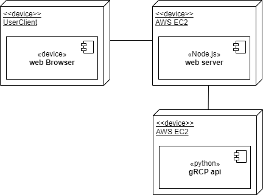

# Taiwan newAQI Visualizer
Team: _The Jaws of Death_  
from: _2019 NASA Hackthon_  
  
  
## User Story  
* As a user of citizen who care air quality for disease.
    * I want to know the index of air quality for specific disease.
    * So that we use machine learning to generate a  index for specific disease accurately and used NASA's web WorldWind api to visualize clearly.  

## 工作項目
### data engineering  
1. 資料蒐集、清洗
2. 建構神經網路(DNN or LSTM)  
3. 建置API(gRCP)  
  

### front-end
1. Mockup 版面設計
2. 圖表設計
3. 特效設計

### back-end
1. AWS EC2 環境架設
2. Web WorldWind api 研究使用
3. api 串接  
  
## Deployment UML  

